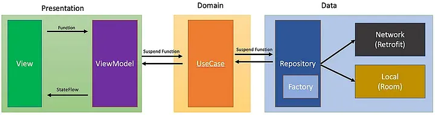

# DiMs

## Архитектура

[](https://medium.com/@ravishankar.ahirwar/mastering-mvvm-clean-architecture-in-android-a-guide-to-domain-layer-and-use-cases-2c8266d3e794)

## Тестирование

### Best Practice стратегия для проекта

Структура для тестов, соответствующая "пирамиде тестирования":

#### 1. Основание пирамиды: Local Unit Tests (`src/test/.*/uint`)
*   **Что:** `UserServiceUnitTest` (с MockK).
*   **Среда:** Чистая JVM.
*   **Цель:** Проверка изолированной логики сервисов.
*   **Количество:** Много.
*   **Скорость:** Максимальная.

#### 2. Середина пирамиды: Integration Tests (`src/test/.*/integration`)
*   **Что:** `UserRepositoryIntegrationTest` (и другие тесты репозиториев).
*   **Среда:** **Robolectric**.
*   **Цель:** Проверка интеграции кода доступа к данным с Room и SQLite.
*   **Количество:** Среднее.
*   **Скорость:** Высокая.

#### 3. Вершина пирамиды: E2E и UI тесты (`src/androidTest`)
*   **Что:** `UserLifecycleInstrumentationTest`.
*   **Среда:** **Эмулятор Android**.
*   **Цель:** Проверка сквозных пользовательских сценариев в реальной среде, убедиться, что все слои приложения работают вместе как единое целое.
*   **Количество:** Мало (только самые критичные сценарии).
*   **Скорость:** Низкая.


## Unit тестирование

Все команды выполняются из корневой папки проекта.

### 1. Выполнение тестов
Чтобы запустить все unit-тесты, выполните:
```bash
./gradlew testDebugUnitTest
```

Чтобы запустить все unit-тесты для конкретного модуля (например, `:data`), выполните:
```bash
./gradlew :data:testDebugUnitTest
```
Любая из этих команд выполнит тесты и сгенерирует сырые результаты. В консоли вы увидите `BUILD SUCCESSFUL`, если все тесты прошли.

### 2. Просмотр результатов

Есть два способа посмотреть детальные результаты:

- Стандартный отчет Gradle

    Gradle автоматически создает простой HTML-отчет.

    ```bash
    xdg-open data/build/reports/tests/testDebugUnitTest/index.html 
    ```

- Интерактивный отчет Allure
    Сгенерируйте и откройте отчет Allure.
    Есть две команды:

    `allureServe` (рекомендуется)

    Генерирует HTML-отчет, запускает локальный веб-сервер и автоматически открывает отчет в браузере. Процесс в терминале будет активен, пока вы его не остановите (`Ctrl + C`).
    ```bash
    ./gradlew allureServe
    ```

    `allureReport`

    Только генерирует HTML-файлы отчета в папку `build/reports/allure-report`. Открывать `index.html` из этой папки нужно вручную. Полезно для CI/CD систем.
    ```bash
    ./gradlew allureReport
    ```

    **Важно:** Команды `allureServe` и `allureReport` собирают результаты из **всех** модулей, где были запущены тесты. Чтобы получить отчет **только для модуля `:data`**, убедитесь, что вы предварительно очистили проект (`./gradlew clean`) и запустили тесты только для `:data`.


### 3. Кастомный скрипт для всех тестов и агрегированного отчёта

```bash
./allure-report.sh
```
